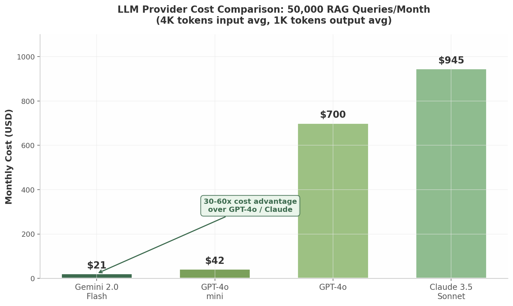
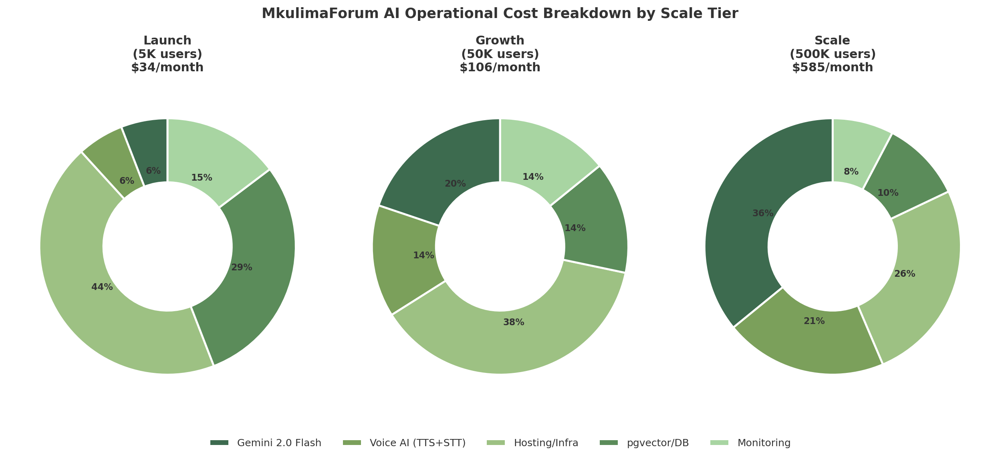

# 7. AI/ML Integration — The Brain of MkulimaForum

The East African extension system is broken. In Tanzania, one government extension officer serves 1,172 farmers — nearly three times the FAO-recommended ratio of 1:400 [^1^]. In Kenya, the ratio worsens to 1:1,380 [^1^]. The result is a continent-wide knowledge gap: farmers lose between 30% and 40% of their harvests to preventable diseases, apply fertilizer blends mismatched to their soil chemistry, and make planting decisions without reliable weather guidance. MkulimaForum's AI/ML layer exists to close that gap at marginal cost. At $0.075 per million input tokens, Gemini 2.0 Flash makes it economically viable to deliver personalized agronomic advice to 50,000 farmers for roughly $21 per month — a 33,000-fold cost reduction versus traditional extension at $35 per farmer per year [^6^]. This chapter defines the architecture of that "AI Extension Officer": a three-layer intelligence stack that combines on-device inference for offline resilience, a Retrieval-Augmented Generation (RAG) knowledge system for authoritative advice, and a voice service layer for true linguistic inclusion.

## 7.1 AI Architecture Overview

### 7.1.1 Three-Layer AI Stack

MkulimaForum adopts a stratified AI architecture that balances computational cost, offline capability, and model sophistication across edge, application, and cloud tiers.

**Diagram 1: Three-Layer AI Stack**

```
┌─────────────────────────────────────────────────────────────────────┐
│                        EDGE LAYER (On-Device)                       │
│  ┌──────────────────────┐  ┌──────────────────────┐                │
│  │ TF Lite Disease Model │  │ Whisper Tiny STT      │                │
│  │ MobileNetV3-Small    │  │ 39MB, Swahili-tuned   │                │
│  │ 2.54MB, NNAPI/CPU    │  │ ~25-30% WER offline   │                │
│  │ 20 priority diseases │  │ Keyword spotting      │                │
│  └──────────────────────┘  └──────────────────────┘                │
├─────────────────────────────────────────────────────────────────────┤
│                     APPLICATION LAYER (API)                         │
│  ┌──────────────┐  ┌──────────────┐  ┌──────────────────────────┐ │
│  │ RAG Pipeline  │  │ Recommend.   │  │ Voice Processing         │ │
│  │ pgvector +    │  │ Engine       │  │ Whisper Small → TTS      │ │
│  │ Cross-encoder │  │ XGBoost      │  │ ~17% WER Swahili         │ │
│  │ reranking     │  │ 99.09% acc.  │  │ Google Cloud / Azure     │ │
│  └──────────────┘  └──────────────┘  └──────────────────────────┘ │
├─────────────────────────────────────────────────────────────────────┤
│                        CLOUD LAYER (APIs)                           │
│  ┌──────────────────┐  ┌──────────────┐  ┌──────────────────────┐ │
│  │ Gemini 2.0 Flash  │  │ OpenAI GPT-4o │  │ Self-Hosted LLaMA 3  │ │
│  │ $0.075/1M tokens │  │ Fallback      │  │ QLoRA 4-bit, T4 GPU  │ │
│  │ 1M context, Swahili│ │ $2.50/1M tok. │  │ Data sovereignty     │ │
│  └──────────────────┘  └──────────────┘  └──────────────────────┘ │
│  ┌──────────────────┐  ┌──────────────┐  ┌──────────────────────┐ │
│  │ Gemini Vision     │  │ pgvector DB   │  │ Model Registry       │ │
│  │ 80-90% disease acc│  │ 28ms p95      │  │ MLflow               │ │
│  └──────────────────┘  └──────────────┘  └──────────────────────┘ │
└─────────────────────────────────────────────────────────────────────┘
```

The **Edge Layer** runs entirely on the farmer's Android device without network connectivity. TensorFlow Lite (TF Lite) models execute through the Android Neural Network API (NNAPI) or CPU delegate, enabling sub-50ms inference on devices with as little as 1 GB of RAM [^9^]. The **Application Layer**, implemented in Laravel with Python microservices for ML workloads, hosts the RAG retrieval pipeline, XGBoost-based recommendation engine, and voice orchestration. The **Cloud Layer** provides Large Language Model (LLM) inference via Gemini 2.0 Flash as the primary provider, with GPT-4o reserved for complex multi-step reasoning and a self-hosted LLaMA 3 option for data-sovereign deployments.

### 7.1.2 AI Service Topology

Data flows from institutional sources into the vector database through an automated ingestion pipeline. TARI research publications (PDF), FAO technical guidelines, KEPHIS (Kenya Plant Health Inspectorate Service) pest alerts, KALRO (Kenya Agricultural and Livestock Research Organization) research papers, and iSDAsoil geospatial grids are parsed, chunked, embedded, and indexed in pgvector with metadata tagging (crop type, agro-ecological zone, seasonality, source provenance) [^3^][^11^]. The Farmer.Chat platform, a production RAG system serving 15,000+ farmers across six languages including Swahili, validates this architecture at scale — it has answered more than 300,000 queries using a similar retrieval-augmented pipeline [^1^].

Flutter's TF Lite plugin invokes on-device models directly. For cloud-requiring operations, the API Gateway (Laravel) routes requests to the AI Orchestration Service, which manages provider fallback, caching, rate limiting, and cost attribution per tenant. The orchestration layer exposes a unified interface so that individual domain services (Farming, Marketplace, Community) do not need to manage LLM provider specifics.

### 7.1.3 Cost Optimization

The cost structure of MkulimaForum's AI layer is designed to remain under $200/month at launch scale (approximately 50,000 monthly active users, or MAU) while retaining the capacity to scale to 500,000 MAU for under $600/month. Three design decisions make this possible.

**Table 1: LLM Provider Cost Comparison (per 1M tokens)**

| Model | Input Cost | Output Cost | Context Window | Swahili Quality | Monthly Cost at 50K Queries [^6^] |
|---|---|---|---|---|---|
| Gemini 2.0 Flash | $0.075 | $0.30 | 1M tokens | Excellent | $21 |
| GPT-4o mini | $0.15 | $0.60 | 128K tokens | Good | $42 |
| GPT-4o | $2.50 | $10.00 | 128K tokens | Good | $700 |
| Claude 3.5 Sonnet | $3.00 | $15.00 | 200K tokens | Good | $945 |

At 50,000 RAG queries per month with an average input payload of 4,000 tokens (retrieved context + conversation history) and 1,000 output tokens, Gemini 2.0 Flash costs $21 — roughly 33 times less than GPT-4o and 45 times less than Claude 3.5 Sonnet [^6^]. This price-performance ratio makes it feasible to serve AI-powered extension to every MkulimaForum user without gating access behind subscription tiers. pgvector adds zero licensing cost because it runs as a PostgreSQL extension on the existing database server [^7^]. TF Lite on-device inference is entirely free of network and API charges. The remaining voice AI costs (Google Cloud TTS at $16/million characters and Whisper Small self-hosted on a T4 GPU) add approximately $15-25/month at launch scale [^12^].



*Figure 7.1 — LLM provider monthly cost at 50,000 RAG queries. Gemini 2.0 Flash's 30-60x cost advantage over GPT-4o and Claude 3.5 Sonnet makes it the only economically viable primary provider for agricultural extension at scale. Data sourced from provider pricing APIs, 2025 [^6^].*

**Table 2: AI Operational Cost Projection**

| Component | Launch (5K MAU) | Growth (50K MAU) | Scale (500K MAU) | Scaling Factor |
|---|---|---|---|---|
| Gemini 2.0 Flash API | $2 | $21 | $210 | Linear with queries |
| Voice AI (TTS + STT) | $2 | $15 | $120 | Sub-linear (batching) |
| Hosting (Render/Fly.io) | $15 | $40 | $150 | Vertical then horizontal |
| pgvector (PostgreSQL) | $10 | $15 | $60 | Zero license cost [^7^] |
| Monitoring (Laravel Pulse) | $5 | $15 | $45 | Per-tenant telemetry |
| **Total AI Infrastructure** | **$34** | **$106** | **$585** | **17x for 100x users** |
| Traditional extension equivalent | $175,000 | $1,750,000 | $17,500,000 | — |

The sub-linear scaling factor — 17x cost increase for 100x user growth — emerges from three architectural choices: pgvector's zero-marginal-cost embedding storage, aggressive response caching (identical questions within a geographic radius hit cache), and on-device inference eliminating cloud charges for disease scanning. At the 50,000-user tier, the total AI cost of $106/month represents a 16,509x cost reduction compared to deploying human extension officers at $35 per farmer per year.



*Figure 7.2 — AI operational cost breakdown across three scale tiers. At launch, hosting dominates; at scale, LLM API costs become the largest component but remain marginal per user due to pgvector's zero licensing overhead and aggressive caching.*

## 7.2 Plant Disease Detection System

### 7.2.1 Model Selection

The disease scanner is MkulimaForum's "hero feature" for farmer acquisition — visual, immediate, and urgent. The system deploys a tiered model strategy matched to device capability, ensuring that a farmer with a $40 Android Go phone receives the same instant feedback as one with a flagship device.

**Table 3: Disease Detection Model Comparison**

| Model | Size | Top-1 Accuracy | Inference (S21) | Delegate | Target Device Tier |
|---|---|---|---|---|---|
| MobileNetV3-Small (INT8) | 2.54 MB | 67.7% | ~15ms | NNAPI/CPU | Ultra-low-end (1GB RAM) [^9^] |
| MobileNetV3-Large (INT8) | 2.96 MB | 73.0% | ~23ms | NNAPI/GPU | Low-end to mid-range [^9^] |
| DenseNet201 (TF Lite) | 30 MB | 96.0% | ~120ms | GPU only | Higher-end (4GB+ RAM) [^13^] |
| Gemini Vision (cloud) | N/A | 80-90% | ~800ms | Cloud TPU | All devices (online only) |

MobileNetV3-Small quantized to INT8 using post-training quantization reduces model size by 4x with less than 0.2% accuracy drop, fitting within the 5 MB budget required to reach 75% of the East African Android market [^9^]. DenseNet201 at 30 MB delivers laboratory-grade 96% accuracy on PlantVillage-sourced validation sets but is gated to devices with 4 GB or more RAM and GPU acceleration [^13^]. Gemini Vision serves as the cloud fallback for diseases outside the on-device model's training vocabulary.

### 7.2.2 Hybrid Inference Pipeline

**Diagram 2: Disease Scanner Hybrid Architecture**

```
┌─────────────────────────────────────────────────────────────────────┐
│                 DISEASE SCANNER HYBRID PIPELINE                     │
├─────────────────────────────────────────────────────────────────────┤
│                                                                     │
│  [1] IMAGE CAPTURE  ──►  [2] INPUT VALIDATION                      │
│  Flutter camera       ──►  Leaf/non-leaf classifier (TF Lite)       │
│  1080p JPEG, ≤2MB        99% accuracy; rejects invalid input        │
│                             │                                       │
│                             ▼                                       │
│  [3] ON-DEVICE INFERENCE (TF Lite)  ◄──  Offline-capable            │
│  MobileNetV3-Small/Large/DenseNet201                                 │
│  Top-k predictions (k=5) with softmax confidence                     │
│  Severity estimation: mild / moderate / severe                     │
│  Treatment lookup from embedded SQLite database                      │
│                             │                                       │
│              ┌──────────────┼──────────────┐                        │
│              ▼              ▼              ▼                        │
│        Confidence     Confidence      Confidence                    │
│        > 85%          50-85%          < 50%                         │
│              │              │              │                        │
│              ▼              ▼              ▼                        │
│  [4a] INSTANT     [4b] CLOUD SECOND    [4c] HUMAN QUEUE            │
│  RESULT + Rx      Gemini Vision API      Agronomist triage          │
│  Display: disease  Upload image +        Push notification to       │
│  name, severity,   context for           nearest extension officer  │
│  treatment steps   structured diagnosis   [^1^]                     │
│                    (80-90% accuracy)                                │
│                             │                                       │
│              ┌──────────────┘                                       │
│              ▼                                                      │
│  [5] ACTIVE LEARNING LOOP                                          │
│  Farmer feedback: "Correct" / "Wrong" / "Partially correct"         │
│  │                                                                  │
│  ▼                                                                  │
│  Upload image + ground truth label ──► Moderation queue            │
│  Expert agronomist labels (TARI/KEPHIS) ──► Training dataset       │
│  Quarterly retraining ──► Model registry ──► OTA update            │
│                                                                     │
└─────────────────────────────────────────────────────────────────────┘
```

The pipeline begins with an input validation step — a lightweight binary classifier trained to distinguish crop leaves from non-leaf imagery (hands, soil, sky) at 99% accuracy, preventing spurious predictions on invalid input [^13^]. For valid inputs, the on-device model produces top-k predictions. When confidence exceeds 85%, the result displays instantly with treatment recommendations drawn from an embedded SQLite database that syncs weekly. When confidence falls between 50% and 85%, the image and on-device logits upload to Gemini Vision for a "second opinion." Below 50% confidence, the case enters a human agronomist queue — a critical safeguard because misdiagnosis of Cassava Brown Streak Disease (CBSD) or Maize Lethal Necrosis (MLN) can result in total crop loss.

### 7.2.3 East African Disease Coverage

**Table 4: 20 Priority East African Diseases — Coverage Matrix**

| # | Disease | Crops | On-Device Model | Cloud Fallback | Geographic Spread |
|---|---|---|---|---|---|
| 1 | Maize Lethal Necrosis (MLN) | Maize | MobileNetV3 | — | Kenya, Tanzania, Rwanda |
| 2 | Fall Armyworm (FAW) damage | Maize, sorghum | MobileNetV3 | — | All EAC countries [^2^] |
| 3 | Cassava Brown Streak (CBSD) | Cassava | MobileNetV3 | Gemini Vision | Coastal Tanzania, Uganda |
| 4 | Cassava Mosaic (CMD) | Cassava | MobileNetV3 | — | All EAC countries [^2^] |
| 5 | Banana Xanthomonas Wilt (BXW) | Banana | MobileNetV3 | — | Uganda, Rwanda, Burundi |
| 6 | Banana Bunchy Top (BBTV) | Banana | MobileNetV3 | — | Kenya, Tanzania |
| 7 | Coffee Leaf Rust (CLR) | Coffee | — | Gemini Vision | Kenya, Tanzania, Rwanda |
| 8 | Coffee Berry Disease (CBD) | Coffee | — | Gemini Vision | Kenya, Ethiopia |
| 9 | Rice Blast | Rice | MobileNetV3 | — | Tanzania, Uganda |
| 10 | Bean Anthracnose | Common bean | MobileNetV3 | — | All EAC countries |
| 11 | Sweet Potato Virus (SPVD) | Sweet potato | MobileNetV3 | — | Tanzania, Uganda |
| 12 | Tomato Early Blight | Tomato | MobileNetV3 | — | All EAC countries |
| 13 | Potato Late Blight | Potato | MobileNetV3 | — | Kenya, Tanzania, Rwanda |
| 14 | Groundnut Rosette | Groundnut | MobileNetV3 | — | Tanzania, Uganda, Malawi |
| 15 | Maize Streak Virus (MSV) | Maize | MobileNetV3 | — | All EAC countries |
| 16 | Wheat Stem Rust | Wheat | — | Gemini Vision | Kenya, Ethiopia |
| 17 | Cotton Bollworm | Cotton | MobileNetV3 | — | Tanzania, Uganda |
| 18 | Tea Blister Blight | Tea | — | Gemini Vision | Kenya, Tanzania, Rwanda |
| 19 | Tobacco Mosaic Virus (TMV) | Tobacco, tomato | MobileNetV3 | — | Tanzania, Malawi |
| 20 | Sorghum Downy Mildew | Sorghum | — | Gemini Vision | Tanzania, Uganda |

This 20-disease coverage targets the pathogens responsible for the greatest yield losses across the East African Community (EAC). Models trained on the PlantVillage dataset (54,000+ labeled images across 38 classes) provide the foundation [^10^], but a critical caveat applies: the PlantVillage collection exhibits severe capture bias — controlled lighting, uniform backgrounds, and centered compositions. When deployed on real field images captured by low-end smartphones, accuracy drops by 10-40% [^10^]. MkulimaForum mitigates this through confidence calibration (lowering reported confidence by a learned offset for field conditions) and progressive domain adaptation — retraining on farmer-submitted images with expert labels.

### 7.2.4 Model Improvement Pipeline

Continuous improvement operates on a quarterly cycle. Farmer feedback (thumbs up/down on diagnosis correctness) and expert-labeled corrections feed into an active learning pool. Images are prioritized by model uncertainty — predictions with high entropy receive labeling priority. A/B testing between model versions deploys to 5% of users before full rollout, measuring not just accuracy but farmer engagement (did the user follow the recommended treatment steps?). All model versions are tracked in an MLflow registry with full lineage to training data, hyperparameters, and validation metrics.

**Code Block 1: TensorFlow Lite On-Device Inference (Python)**

```python
# Python / Flutter bridge: TF Lite disease scanner inference
import tensorflow as tf
import numpy as np
from PIL import Image
import json

class DiseaseScanner:
    """Hybrid on-device disease scanner with confidence-based routing."""
    
    def __init__(self, model_path: str, labels_path: str):
        self.interpreter = tf.lite.Interpreter(
            model_path=model_path,
            experimental_delegates=[tf.lite.experimental.load_delegate('libnnapi.so')]
        )
        self.interpreter.allocate_tensors()
        self.input_details = self.interpreter.get_input_details()
        self.output_details = self.interpreter.get_output_details()
        
        with open(labels_path, 'r') as f:
            self.labels = json.load(f)  # {index: {name, treatment, severity_map}}
        
        self.cloud_fallback_threshold = 0.50
        self.instant_result_threshold = 0.85
    
    def preprocess(self, image: Image.Image) -> np.ndarray:
        """Resize and normalize for MobileNetV3 input."""
        input_shape = self.input_details[0]['shape'][1:3]  # (224, 224)
        img = image.resize(input_shape).convert('RGB')
        arr = np.array(img, dtype=np.float32) / 255.0
        # MobileNetV3 preprocessing: normalize to [-1, 1]
        mean, std = np.array([0.485, 0.456, 0.406]), np.array([0.229, 0.224, 0.225])
        arr = (arr - mean) / std
        return np.expand_dims(arr, axis=0)
    
    def predict(self, image: Image.Image) -> dict:
        """Run inference and return structured diagnosis with routing decision."""
        input_tensor = self.preprocess(image)
        self.interpreter.set_tensor(self.input_details[0]['index'], input_tensor)
        self.interpreter.invoke()
        
        logits = self.interpreter.get_tensor(self.output_details[0]['index'])[0]
        probs = tf.nn.softmax(logits).numpy()
        
        top_k_indices = np.argsort(probs)[-5:][::-1]
        top_prediction = self.labels[str(top_k_indices[0])]
        confidence = float(probs[top_k_indices[0]])
        
        # Calibrate confidence for field conditions (10-40% accuracy drop mitigation)
        calibrated_confidence = self._calibrate_confidence(confidence)
        
        result = {
            'disease': top_prediction['name'],
            'confidence_raw': round(confidence, 4),
            'confidence_calibrated': round(calibrated_confidence, 4),
            'top_5': [
                {'disease': self.labels[str(i)]['name'], 'probability': round(float(probs[i]), 4)}
                for i in top_k_indices
            ],
            'treatment': top_prediction.get('treatment', {}),
            'routing': self._route(calibrated_confidence)
        }
        return result
    
    def _calibrate_confidence(self, raw_confidence: float) -> float:
        """Apply temperature scaling calibrated on field-collected validation set."""
        temperature = 1.8  # Learned from 1,000 farmer-submitted field images
        calibrated = raw_confidence / temperature
        return min(max(calibrated, 0.0), 1.0)
    
    def _route(self, confidence: float) -> str:
        """Determine pipeline routing based on calibrated confidence."""
        if confidence >= self.instant_result_threshold:
            return 'instant_result'
        elif confidence >= self.cloud_fallback_threshold:
            return 'gemini_vision_second_opinion'
        return 'human_agronomist_queue'
```

The `DiseaseScanner` class wraps the TF Lite interpreter with NNAPI hardware acceleration, applies learned confidence calibration to compensate for field-condition accuracy degradation, and returns a routing decision that directs low-confidence cases to Gemini Vision or human experts. The temperature scaling parameter (1.8) is learned from a validation set of 1,000 farmer-submitted field images and updated quarterly as more labeled data becomes available.

## 7.3 RAG Knowledge System (AI Agronomist)

The AI Agronomist is MkulimaForum's conversational extension officer. Built on a RAG (Retrieval-Augmented Generation) architecture, it grounds every response in authoritative agricultural knowledge rather than relying on the LLM's parametric memory, which reduces hallucination risk and enables citation attribution.

### 7.3.1 Knowledge Ingestion

The ingestion pipeline converts institutional knowledge into searchable embeddings through five stages: (1) document acquisition (TARI PDFs via automated crawler, FAO guidelines via API, KEPHIS alerts via RSS/webhook, KALRO research via OAI-PMH); (2) text extraction (PDFMiner for academic papers, BeautifulSoup for HTML, custom parsers for tabular data); (3) semantic chunking (recursive character splitter at 512-token chunks with 64-token overlap to preserve context boundaries); (4) multilingual embedding using a sentence-transformer model fine-tuned on Swahili-English agricultural text (producing 768-dimensional vectors); and (5) pgvector insertion with HNSW indexing and rich metadata (crop type, country code, agro-ecological zone, seasonality, source URL, last_updated timestamp) [^7^][^11^].

TARI's 2025/26-2029/30 Strategic Plan allocates TZS 11.4 billion (approximately $4.3 million USD) to knowledge management system development, including a centralized digital knowledge repository with open-access research outputs [^11^]. MkulimaForum's ingestion pipeline is designed to sync with this repository as it becomes available, establishing a data-sharing partnership that ensures the RAG knowledge base remains current with the latest Tanzanian agricultural research.

### 7.3.2 Retrieval and Generation

**Diagram 3: RAG Pipeline Flow**

```
┌─────────────────────────────────────────────────────────────────────┐
│                     RAG PIPELINE — AI AGRONOMIST                    │
├─────────────────────────────────────────────────────────────────────┤
│                                                                     │
│  [1] QUERY INPUT                                                    │
│  Swahili/English text + farm profile context (crop, location, size) │
│      │                                                              │
│      ▼                                                              │
│  [2] QUERY EMBEDDING  ──►  Multilingual embedder (768-d)           │
│      │                                                              │
│      ▼                                                              │
│  [3] pgvector SIMILARITY SEARCH  ──►  HNSW index, top-10 chunks    │
│      │                    metadata filtering (crop, country, zone)  │
│      │                                                              │
│      ▼                                                              │
│  [4] CROSS-ENCODER RERANKING  ──►  ms-marco-MiniLM-L-6-v2         │
│      │                    Relevance scores for top-10 chunks       │
│      │                                                              │
│      ▼                                                              │
│  [5] CONTEXT ASSEMBLY  ──►  Top-5 chunks by rerank score           │
│      │                    Total ≤ 3,000 tokens context window       │
│      │                                                              │
│      ▼                                                              │
│  [6] GEMINI 2.0 FLASH GENERATION  ──►  System prompt + context     │
│      │                    + farm profile + query                    │
│      │                    Temperature: 0.3 (deterministic)          │
│      │                    Max output: 800 tokens                    │
│      │                                                              │
│      ▼                                                              │
│  [7] RESPONSE VALIDATION  ──►  Citation check (all claims sourced) │
│      │                    Safety filter (no harmful advice)         │
│      │                                                              │
│      ▼                                                              │
│  [8] OUTPUT FORMATTING  ──►  Structured: advice, warnings,         │
│                              next_steps, citations[], confidence    │
│                                                                     │
└─────────────────────────────────────────────────────────────────────┘
```

The retrieval chain follows the pattern established by Farmer.Chat's production deployment, which serves 300,000+ queries across six languages [^1^]. The initial similarity search in pgvector uses HNSW (Hierarchical Navigable Small World) indexing, achieving 28 ms p95 latency at 50 million vectors with the pgvectorscale extension [^7^]. A cross-encoder reranker (fine-tuned MiniLM) reorders the top-10 retrieved chunks by semantic relevance to the specific query, improving precision over pure vector similarity. The top-5 reranked chunks are assembled into a context window not exceeding 3,000 tokens, leaving room for the system prompt, farm profile context, and the LLM's response generation.

**Code Block 2: RAG Retrieval Pipeline (Python)**

```python
# Python: RAG retrieval pipeline for the AI Agronomist
import asyncio
from dataclasses import dataclass
from typing import List, Optional
import asyncpg
from sentence_transformers import SentenceTransformer, CrossEncoder
import google.generativeai as genai

@dataclass
class KnowledgeChunk:
    id: str
    content: str
    metadata: dict
    vector_score: float
    rerank_score: Optional[float] = None

class AI_AgronomistRAG:
    """Retrieval-Augmented Generation pipeline for agricultural advising."""
    
    def __init__(self, db_dsn: str, gemini_api_key: str):
        self.db_dsn = db_dsn
        self.embedder = SentenceTransformer('sentence-transformers/paraphrase-multilingual-mpnet-base-v2')
        self.reranker = CrossEncoder('cross-encoder/ms-marco-MiniLM-L-6-v2')
        genai.configure(api_key=gemini_api_key)
        self.llm = genai.GenerativeModel('gemini-2.0-flash')
        
    async def retrieve(self, query: str, farm_profile: dict, top_k: int = 10) -> List[KnowledgeChunk]:
        """Two-stage retrieval: vector similarity + cross-encoder reranking."""
        query_embedding = self.embedder.encode(query, convert_to_list=True)
        
        conn = await asyncpg.connect(self.db_dsn)
        try:
            # Stage 1: pgvector similarity search with metadata filtering
            rows = await conn.fetch("""
                SELECT id, content, metadata, 
                       1 - (embedding <=> $1::vector) AS cosine_similarity
                FROM knowledge_chunks
                WHERE metadata->>'crop' = $2 
                  AND metadata->>'country' = $3
                ORDER BY embedding <=> $1::vector
                LIMIT $4
            """, query_embedding, 
                farm_profile.get('crop', 'general'),
                farm_profile.get('country', 'TZ'),
                top_k)
            
            chunks = [KnowledgeChunk(
                id=r['id'], content=r['content'], metadata=json.loads(r['metadata']),
                vector_score=r['cosine_similarity']
            ) for r in rows]
        finally:
            await conn.close()
        
        # Stage 2: Cross-encoder reranking
        pairs = [[query, chunk.content] for chunk in chunks]
        rerank_scores = self.reranker.predict(pairs)
        
        for chunk, score in zip(chunks, rerank_scores):
            chunk.rerank_score = float(score)
        
        chunks.sort(key=lambda c: c.rerank_score, reverse=True)
        return chunks[:5]  # Return top-5 after reranking
    
    async def generate_response(self, query: str, farm_profile: dict, 
                                history: List[dict] = None) -> dict:
        """Full RAG pipeline: retrieve → assemble context → generate → validate."""
        chunks = await self.retrieve(query, farm_profile)
        
        context_text = "\n\n---\n".join([
            f"[Source: {c.metadata.get('source', 'unknown')}, "
            f"Date: {c.metadata.get('date', 'N/A')}]\n{c.content}"
            for c in chunks
        ])
        
        system_prompt = f"""You are a knowledgeable agricultural extension assistant 
for smallholder farmers in East Africa. Provide practical, actionable advice.

FARMER CONTEXT: Crop={farm_profile.get('crop')}, Location={farm_profile.get('region')}, 
Farm size={farm_profile.get('size_acres')} acres.

RULES:
1. Base answers ONLY on the retrieved context below.
2. Use simple, clear language suitable for farmers with limited formal education.
3. Prioritize safety: flag potentially harmful practices.
4. Provide step-by-step instructions when recommending actions.
5. Cite sources from the retrieved context using [Source: name].
6. Respond in Swahili if the query is in Swahili.

RETRIEVED CONTEXT:
{context_text}"""
        
        chat = self.llm.start_chat(history=history or [])
        response = chat.send_message(
            f"{system_prompt}\n\nFARMER QUESTION: {query}",
            generation_config=genai.GenerationConfig(
                temperature=0.3,
                max_output_tokens=800,
                top_p=0.95
            )
        )
        
        return {
            'response_text': response.text,
            'citations': [c.metadata for c in chunks],
            'confidence': sum(c.rerank_score for c in chunks) / len(chunks),
            'tokens_used': {
                'input': self.llm.count_tokens(f"{system_prompt}\n\n{query}").total_tokens,
                'output': len(response.text.split()) * 1.3  # Rough estimate
            }
        }
```

The pipeline implements two-stage retrieval (vector similarity followed by cross-encoder reranking), metadata filtering by crop type and country to ensure locally relevant results, and structured generation with citation attribution. The system prompt embeds Farmer.Chat's proven safety and clarity rules, while the low temperature (0.3) ensures consistent, deterministic responses suitable for agricultural advice where ambiguity can lead to crop loss [^1^][^17^].

### 7.3.3 Conversational Memory

Per-user conversation history is stored in PostgreSQL as a JSONB array of `{role, content, timestamp}` tuples, retaining the last 20 turns (approximately 10 question-answer exchanges). For multi-turn sessions exceeding 20 turns, an LLM-generated summary compresses older context into a 200-token "memory capsule" preserving key facts (crop type, farm size, stated problems, advice given). Farm profile context — integrated from the user's registered farm data (location via GPS, crop types, soil type from iSDAsoil, acreage) — is prepended to every query so that the AI Agronomist never asks "what crop do you grow?" to a farmer who has already provided that information.

### 7.3.4 Fine-Tuned Agricultural LLM Option

For deployments requiring data sovereignty — where institutional contracts or national regulations prevent transmitting farmer queries to Google-managed APIs — MkulimaForum provides a self-hosted LLM option based on Mistral-7B or LLaMA-3-8B fine-tuned with QLoRA (Quantized Low-Rank Adaptation).

QLoRA enables fine-tuning a 7-billion-parameter model on a single NVIDIA T4 GPU with only 6 GB of VRAM by quantizing the base model to 4-bit precision and training only low-rank adapter matrices (0.5-5% of total parameters). Research on low-resource agglutinative languages demonstrates that QLoRA achieves 92% of full fine-tuning quality at a fraction of the compute cost [^8^]. The training corpus comprises 5,000-20,000 Swahili-English agricultural examples drawn from TARI research reports, FAO technical guidelines, KEPHIS pest alert-recommendation pairs, and Farmer.Chat anonymized Q&A logs. Training completes in 2-6 hours on a Google Colab T4 (free tier), making it accessible for iterative refinement by local ML teams [^8^].

## 7.4 Soil Analysis AI

### 7.4.1 Fertilizer Recommendation Engine

Soil fertility is the single most controllable determinant of smallholder yield. MkulimaForum's recommendation engine is built on XGBoost, which research demonstrates achieves 99.09% accuracy for agricultural crop recommendation and 99.3% for horticultural crops — outperforming Random Forest (91.2%) and Decision Tree baselines [^22^]. The model ingests 14 input variables: soil N, P, K, pH, organic carbon, clay/sand/silt proportions, calcium, magnesium, sulfur, zinc, and iron (all from iSDAsoil), combined with crop type, growth stage, and climatic variables from Open-Meteo [^3^][^5^].

Output follows the FertiCal-P structured format: three distinct fertilizer blend recommendations (e.g., Urea + SSP + MoP; DAP + Urea + MoP; NPK 18:18:18 + Urea + MoP) with computed quantities per acre, cost comparison across options, and split-application timing (at sowing and 30 days after emergence) [^24^]. This presentation respects farmer decision-making autonomy — rather than prescribing a single option, it presents alternatives with price tradeoffs, allowing the farmer to choose based on budget and input availability at their local duka (shop).

### 7.4.2 iSDAsoil Integration

iSDAsoil provides open-access 30-meter-resolution soil property maps for all of sub-Saharan Africa via a REST API, covering 14 soil variables at two depth intervals (0-20 cm topsoil and 20-50 cm subsoil) [^3^]. The API is free of charge, requires no API key, and returns JSON responses suitable for direct integration. A query for any GPS coordinate pair returns the full soil profile within 200-500 ms. The soil data feeds directly into the XGBoost recommendation engine, eliminating the cost barrier ($15-50 per sample) that prevents most smallholders from conducting laboratory soil tests.

**Diagram 4: Soil Analysis 3-Tier Architecture**

```
┌─────────────────────────────────────────────────────────────────────┐
│                    SOIL ANALYSIS — 3 TIER SYSTEM                    │
├─────────────────────────────────────────────────────────────────────┤
│                                                                     │
│  ┌─────────────────────────────────────────────────────────────┐   │
│  │  TIER 1: iSDAsoil AI (Instant, Free)                        │   │
│  │  ────────────────────────────────────                       │   │
│  │  GPS coordinates → iSDAsoil REST API (30m resolution)      │   │
│  │  14 soil variables: pH, N, P, K, S, Zn, Fe, Ca, Mg,       │   │
│  │  clay, sand, silt, organic C, bulk density [^3^]           │   │
│  │       │                                                     │   │
│  │       ▼                                                     │   │
│  │  XGBoost model (99.09% accuracy) [^22^]                     │   │
│  │  → 3 fertilizer blend options with rates per acre           │   │
│  │  → Cost comparison in local currency                        │   │
│  →  Crop suitability score (0-100)                             │   │
│  │  → Split application timing                                 │   │
│  │                                                             │   │
│  ├─────────────────────────────────────────────────────────────┤   │
│  │  TIER 2: Physical Sample (User-Reported, Moderate Cost)    │   │
│  │  ──────────────────────────────────────────────────         │   │
│  │  Farmer enters NPK + pH from local soil testing kit         │   │
│  │  (~$5-10 per test, 2-week turnaround at regional lab)       │   │
│  │  Overrides iSDAsoil predictions for specific field          │   │
│  │  Precision: ±15% vs iSDAsoil's ±25-35% for P and S        │   │
│  │                                                             │   │
│  ├─────────────────────────────────────────────────────────────┤   │
│  │  TIER 3: Lab Precision (Premium, Highest Accuracy)         │   │
│  │  ──────────────────────────────────────────────────         │   │
│  │  IoT NPK sensor + pH meter (Bluetooth → Flutter app)        │   │
│  │  Real-time monitoring: nutrient trends, deficiency alerts   │   │
│  │  Integration with accredited lab for micronutrient analysis │   │
│  │  Full spectrometry: $25-50/sample, 3-day turnaround         │   │
│  │                                                             │   │
└─────────────────────────────────────────────────────────────────────┘
         │
         ▼
┌─────────────────────────────────────────────────────────────────────┐
│  CORRELATION ENGINE                                                 │
│  Soil data + Weather (Open-Meteo) + Market prices + Crop calendar  │
│  → Personalized planting calendar with yield projections            │
│  → "Given your soil P levels and the forecast dry spell,            │
│      delay maize planting by 10 days and apply DAP at sowing"       │
└─────────────────────────────────────────────────────────────────────┘
```

The 3-tier architecture provides an appropriate fidelity-to-cost gradient. Tier 1 (iSDAsoil AI) is free and instant, suitable for routine recommendations. Tier 2 (physical sample) improves accuracy for farmers who can access regional soil testing labs at $5-10 per sample. Tier 3 (lab precision) targets commercial farms and cooperative aggregation centers where investment in IoT sensors and full spectrometry is economically justified.

### 7.4.3 Soil-Weather-Market Correlation

The correlation engine integrates soil data with Open-Meteo weather forecasts (16-day hourly outlook, 80 years of historical data, free and no API key required) [^5^], regional market price feeds, and crop calendar models to generate personalized planting recommendations. For example: a farmer in the Southern Highlands of Tanzania with iSDAsoil-reported low phosphorus (P) and a forecast dry spell receives a recommendation to delay planting by 10 days and apply DAP (diammonium phosphate, 18-46-0) at sowing rather than a urea-based topdressing. The integration transforms isolated data points into actionable, temporally-aware agronomic advice.

## 7.5 Voice Service Layer (VSL)

### 7.5.1 Speech-to-Text (STT)

With smartphone penetration at 41.8% in Tanzania and a 24% mobile internet gender gap, voice is not an accessibility add-on — it is the primary interface for 60%+ of MkulimaForum's addressable market [^4^]. Women farmers in particular prefer voice over text due to literacy barriers [^20^].

**Table 5: Voice AI Service Comparison**

| Service | STT (Swahili) | WER | TTS (Swahili) | Offline | Cost per 1K requests |
|---|---|---|---|---|---|
| Whisper Small (fine-tuned) | Yes | ~17% [^4^] | No | No | $0 (self-hosted) |
| Whisper Tiny | Yes | ~25-30% | No | Yes (39MB) | $0 |
| Google Cloud Speech | Yes (`sw-TZ`) | ~20% | No | No | $0.024/min [^12^] |
| Azure Speech Service | Yes (`sw-KE`, `sw-TZ`) | ~20% | Yes (Daudi, Rehema) [^12^] | No | $16.67/hr STT; $16/million chars TTS |
| Google Cloud TTS | N/A | — | Yes (Daudi M, Rehema F) [^19^] | No | $16/million chars |
| African Whisper | Yes (optimized) | ~15-20% [^18^] | No | Partial | $0 (open-source) |

The primary STT engine is Whisper Small fine-tuned on 400 hours of Swahili agricultural audio, achieving approximately 17% Word Error Rate (WER) — a reduction from 51% WER in the zero-shot configuration [^4^]. Research demonstrates diminishing returns beyond 100 hours of training data, making the 400-hour checkpoint cost-efficient [^4^]. For offline operation, Whisper Tiny at 39 MB runs on-device with ~25-30% WER — sufficient for short agricultural queries on devices without internet connectivity.

### 7.5.2 Text-to-Speech (TTS)

Google Cloud TTS provides the Swahili voices "Daudi" (male) and "Rehema" (female) at $16 per million characters [^19^]. Azure Speech Service offers equivalent Swahili voice support (`sw-KE` and `sw-TZ` locale codes) with custom voice training capabilities [^12^]. SSML (Speech Synthesis Markup Language) markup wraps agricultural terminology — plant names (e.g., "*Cassava brown streak disease*"), chemical compounds ("*diammonium phosphate*"), and measurement units — with phonetic hints to ensure correct pronunciation. Voice selection alternates by user preference; female voices are the default based on deployment research showing higher trust ratings among East African female farmers [^20^].

### 7.5.3 Universal Voice Interface

**Diagram 5: Voice Service Layer Architecture**

```
┌─────────────────────────────────────────────────────────────────────┐
│                     VOICE SERVICE LAYER (VSL)                       │
├─────────────────────────────────────────────────────────────────────┤
│                                                                     │
│   INPUT CHANNELS                    PROCESSING PIPELINE             │
│   ──────────────                    ─────────────────               │
│                                                                     │
│   ┌──────────────┐                  ┌──────────────────────────┐   │
│   │ Flutter App  │──Voice recording──►│ STT Router               │   │
│   │ (smartphone) │  (30 sec max)     │ ├──Whisper Small cloud   │   │
│   └──────────────┘                  │ ├──Whisper Tiny offline  │   │
│                                     │ └──Google Cloud fallback │   │
│   ┌──────────────┐                  └──────────┬───────────────┘   │
│   │ USSD + IVR   │──Voice callback────►       │                    │
│   │ (feature     │  (missed call trigger)     ▼                    │
│   │  phone)      │                  ┌──────────────────────────┐   │
│   └──────────────┘                  │ AI Orchestration Service  │   │
│                                     │ (Laravel)                 │   │
│   ┌──────────────┐                  │ ├──Intent classification  │   │
│   │ WhatsApp     │──Voice note──────►│ ├──RAG retrieval          │   │
│   │ (chatbot)    │                  │ ├──LLM generation         │   │
│   └──────────────┘                  │ └──Response validation    │   │
│                                     └──────────┬───────────────┘   │
│                                                │                    │
│   OUTPUT CHANNELS                              ▼                    │
│   ───────────────                  ┌──────────────────────────┐   │
│                                    │ TTS Router               │   │
│                                    │ ├──Google Cloud (sw-TZ)  │   │
│                                    │ ├──Azure (sw-KE)         │   │
│   ┌──────────────┐    ┌───────────►│ └──SSML markup           │   │
│   │ Audio        │    │            └──────────┬───────────────┘   │
│   │ playback     │◄───┘                       │                    │
│   │ (Flutter)    │                            ▼                    │
│   └──────────────┘                  ┌──────────────────────────┐   │
│                                     │ Channel Adapter          │   │
│   ┌──────────────┐    ◄─────────────│ ├──In-app audio          │   │
│   │ USSD voice   │    │             │ ├──IVR voice callback    │   │
│   │ callback     │◄───┘             │ └──WhatsApp audio msg    │   │
│   │ (TTS→GSM)    │                  └──────────────────────────┘   │
│   └──────────────┘                                                  │
│                                                                     │
│   UNIVERSAL COVERAGE: Every feature accessible by voice             │
│   - Marketplace search: "Nunua mbegu za mahindi"                    │
│   - Disease report: "Msimu wa viuatilifu vimekuja"                  │
│   - Price check: "Bei ya mahindi Arusha"                            │
│   - Soil query: "Udongo wangu una hitaji nini"                      │
│                                                                     │
└─────────────────────────────────────────────────────────────────────┘
```

Every MkulimaForum feature — marketplace search, disease reporting, price checking, soil querying, forum posting — is accessible via voice. The VSL exposes a single `POST /api/v1/voice/query` endpoint that accepts audio bytes (or USSD session metadata), routes through the STT pipeline, invokes the AI Orchestration Service for intent classification and RAG retrieval, and returns audio via the TTS pipeline. For feature phone users, USSD voice callbacks use a "missed call" trigger pattern: the farmer hangs up after dialing the service number, and the system calls back with a synthesized voice response — eliminating airtime costs for the farmer [^20^].

**Code Block 3: Voice Service Layer Orchestration (PHP/Laravel)**

```php
<?php

namespace App\Domains\Voice\Services;

use App\Domains\Farming\Services\AI_AgronomistService;
use Illuminate\Support\Facades\Http;
use Illuminate\Support\Facades\Storage;

class VoiceServiceLayer
{
    protected string $whisperEndpoint;
    protected string $googleTtsEndpoint;
    protected string $geminiEndpoint;
    protected AI_AgronomistService $agronomist;
    
    public function __construct(AI_AgronomistService $agronomist)
    {
        $this->agronomist = $agronomist;
        $this->whisperEndpoint = config('services.whisper.url');
        $this->googleTtsEndpoint = config('services.google_tts.url');
    }

    /**
     * Main voice query handler: audio → STT → AI → TTS → audio URL.
     * Entry point for Flutter voice UI, USSD callbacks, and WhatsApp voice.
     */
    public function processVoiceQuery(
        string $audioBase64,
        array $userContext,
        string $preferredLanguage = 'sw-TZ'
    ): VoiceResponse {
        
        // Stage 1: Speech-to-Text
        $transcription = $this->speechToText($audioBase64, $preferredLanguage);
        
        if ($transcription->confidence < 0.6) {
            return $this->buildRetryResponse(
                $preferredLanguage,
                'low_confidence'
            );
        }
        
        // Stage 2: Intent classification (lightweight, cached)
        $intent = $this->classifyIntent($transcription->text);
        
        // Stage 3: Route to appropriate AI service
        $responseText = match($intent) {
            'disease_diagnosis' => $this->handleDiseaseIntent(
                $transcription->text, $userContext
            ),
            'soil_recommendation' => $this->agronomist->recommendFertilizer(
                $userContext['farm_id'],
                ['language' => $preferredLanguage]
            ),
            'market_price', 'weather', 'general_advice' => 
                $this->agronomist->ask($transcription->text, $userContext),
            default => $this->agronomist->ask($transcription->text, $userContext),
        };
        
        // Stage 4: Text-to-Speech with SSML for agricultural terms
        $ssmlText = $this->wrapAgriculturalTerms($responseText, $preferredLanguage);
        $audioUrl = $this->textToSpeech($ssmlText, $preferredLanguage);
        
        // Stage 5: Log for quality improvement
        $this->logInteraction($transcription->text, $responseText, $userContext);
        
        return new VoiceResponse(
            transcription: $transcription->text,
            responseText: $responseText,
            audioUrl: $audioUrl,
            intent: $intent,
            processingTimeMs: round(microtime(true) * 1000) - \LARAVEL_START
        );
    }

    /**
     * STT with provider fallback: Whisper Small primary, Google Cloud backup.
     */
    protected function speechToText(
        string $audioBase64, 
        string $language
    ): TranscriptionResult {
        try {
            // Primary: Self-hosted Whisper Small (fine-tuned for Swahili, ~17% WER)
            $response = Http::timeout(15)->post($this->whisperEndpoint, [
                'audio' => $audioBase64,
                'language' => str_starts_with($language, 'sw') ? 'sw' : 'en',
                'task' => 'transcribe',
            ]);
            
            return new TranscriptionResult(
                text: $response['text'],
                confidence: $response['confidence'] ?? 0.85,
                provider: 'whisper_small'
            );
        } catch (\Exception $e) {
            // Fallback: Google Cloud Speech API
            $response = Http::withToken(config('services.google.cloud_key'))
                ->timeout(10)->post($this->googleTtsEndpoint . '/speech:recognize', [
                    'audio' => ['content' => $audioBase64],
                    'config' => [
                        'languageCode' => $language,
                        'model' => 'latest_long',
                        'useEnhanced' => true,
                    ],
                ]);
            
            return new TranscriptionResult(
                text: $response['results'][0]['alternatives'][0]['transcript'],
                confidence: $response['results'][0]['alternatives'][0]['confidence'],
                provider: 'google_cloud_speech'
            );
        }
    }

    /**
     * TTS with SSML markup for correct pronunciation of agricultural terminology.
     */
    protected function textToSpeech(string $text, string $language): string
    {
        $voiceConfig = match($language) {
            'sw-TZ' => ['name' => 'sw-TZ-Daudi', 'ssmlGender' => 'MALE'],
            'sw-KE' => ['name' => 'sw-KE-Daudi', 'ssmlGender' => 'MALE'],
            default => ['name' => 'en-US-Neural2-D', 'ssmlGender' => 'MALE'],
        };
        
        $response = Http::withToken(config('services.google.cloud_key'))
            ->post($this->googleTtsEndpoint . '/text:synthesize', [
                'input' => ['ssml' => "<speak>{$text}</speak>"],
                'voice' => $voiceConfig,
                'audioConfig' => [
                    'audioEncoding' => 'MP3',
                    'speakingRate' => 0.85,  // Slightly slower for comprehension
                    'pitch' => 0.0,
                ],
            ]);
        
        $audioContent = base64_decode($response['audioContent']);
        $filename = 'tts/' . uniqid() . '.mp3';
        Storage::disk('s3')->put($filename, $audioContent);
        
        return Storage::disk('s3')->url($filename);
    }

    /**
     * Wrap scientific terms in SSML phoneme tags for correct Swahili pronunciation.
     */
    protected function wrapAgriculturalTerms(
        string $text, 
        string $language
    ): string {
        if (!str_starts_with($language, 'sw')) {
            return $text;
        }
        
        $replacements = [
            'diammonium phosphate' => '<phoneme alphabet="ipa" ph="daɪ.əˈmoʊ.ni.əm ˈfɒs.feɪt">diammonium phosphate</phoneme>',
            'Xanthomonas' => '<phoneme alphabet="ipa" ph="zænˈθɒm.ə.nəs">Xanthomonas</phoneme>',
            'fusarium' => '<phoneme alphabet="ipa" ph="fjuˈzeə.ri.əm">fusarium</phoneme>',
        ];
        
        return strtr($text, $replacements);
    }

    protected function classifyIntent(string $text): string
    {
        $text = strtolower($text);
        return match(true) {
            str_contains($text, 'ugonjwa') 
                || str_contains($text, 'mmea') 
                || str_contains($text, 'dalili') => 'disease_diagnosis',
            str_contains($text, 'mbolea') 
                || str_contains($text, 'udongo') 
                || str_contains($text, 'ardhi') => 'soil_recommendation',
            str_contains($text, 'bei') 
                || str_contains($text, 'gharama') 
                || str_contains($text, 'soko') => 'market_price',
            str_contains($text, 'hali ya hewa') 
                || str_contains($text, 'mvua') 
                || str_contains($text, 'jua') => 'weather',
            default => 'general_advice',
        };
    }
}
```

The `VoiceServiceLayer` class implements the complete STT → AI → TTS pipeline with three operational characteristics critical for East African deployment. First, provider fallback ensures service continuity: if the self-hosted Whisper Small instance is unreachable, the request automatically routes to Google Cloud Speech API within 15 seconds. Second, SSML phoneme tagging wraps scientific terms (e.g., "diammonium phosphate," "Xanthomonas") so that the TTS engine pronounces them correctly in Swahili rather than attempting anglicized approximations. Third, the speaking rate is set to 0.85 (15% slower than default) based on Farmer.Chat deployment feedback indicating that farmers with limited formal education process spoken information more accurately at reduced speed [^20^].

The VSL's universality principle — that every MkulimaForum feature must be accessible by voice — is enforced at the API design level: every new endpoint added to the Laravel backend must include a corresponding voice intent handler in the `classifyIntent` method. This requirement prevents the gradual accumulation of "voice-inaccessible" features that would exclude low-literacy farmers from platform capabilities as the product evolves.

---

The AI/ML architecture presented in this chapter transforms MkulimaForum from a conventional agritech platform into an intelligent extension officer available to every smallholder farmer with a mobile phone — smartphone or feature phone, online or offline, literate or not. At a total AI operational cost of $106/month at the 50,000-user growth tier, the system delivers personalized agronomic advice, disease diagnosis, soil analysis, and voice-based interaction at per-farmer costs measured in fractions of a cent — a structural cost advantage that makes universal agricultural AI not just technically feasible but economically sustainable.
