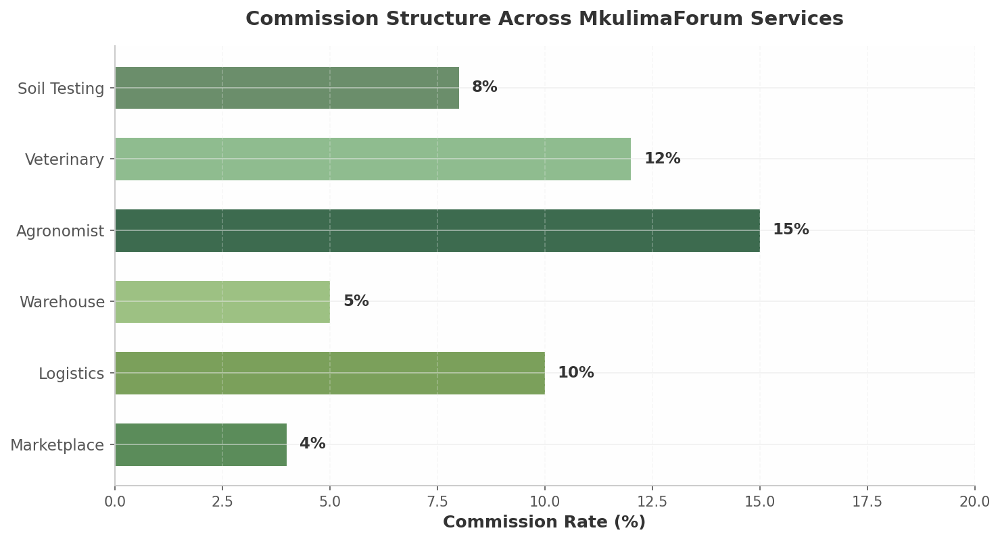

## 11. Payment & Financial Architecture — Mobile Money, Escrow, Insurance

MkulimaForum's marketplace cannot function without a payment layer that respects the financial realities of East African smallholders: cash-dominant economies, high counterparty distrust (Insight 1 — the "trust gap"), and near-ubiquitous mobile money penetration. This chapter specifies the unified payment architecture, sub-wallet and escrow mechanics, commission engine, and agricultural insurance integration.

### 11.1 Mobile Money Integration

#### 11.1.1 Unified Payment Gateway Router

East Africa's mobile money landscape is fragmented. Tanzania hosts six licensed providers — M-Pesa, Airtel Money, Mixx by Yass (formerly Tigo Pesa), HaloPesa, T-Pesa, and AzamPesa — driving most platforms toward aggregators like ClickPesa [^4^][^104^][^112^]. Kenya's M-Pesa Daraja 3.0 offers cloud-native architecture at 12,000 TPS with 105,000+ registered developers [^1^][^2^]. Uganda and Rwanda both use MTN MoMo Open APIs with sandbox-to-production timelines of approximately 10 days after KYC [^5^][^105^]. Rwanda additionally provides IremboPay, a government-backed unified API normalizing multiple providers [^128^][^132^].

MkulimaForum's Payment Gateway Router implements a provider-agnostic abstraction following the IremboPay pattern [^128^][^132^]. The router accepts standardized requests internally and dispatches them to country-specific connectors handling authentication, payload formatting, and callback normalization.

```
┌─────────────────────────────────────────────────────────────────────────────┐
│                    PAYMENT GATEWAY ROUTER ARCHITECTURE                       │
│                                                                             │
│   ┌──────────────┐     ┌─────────────────────────────────────────────────┐  │
│   │  Flutter App │────►│         PaymentGatewayRouter (Laravel)          │  │
│   │  (STK Push)  │     │  ┌──────────────┐  ┌─────────────────────────┐  │  │
│   └──────────────┘     │  │ CountryCode  │  │   Provider Registry     │  │  │
│                        │  │   Resolver   │  │  (mpesa, momo, airtel)  │  │  │
│                        │  └──────┬───────┘  └─────────────────────────┘  │  │
│   ┌──────────────┐     │  ┌──────▼──────┐  ┌──────────┐  ┌──────────┐  │  │
│   │  Admin API   │────►│  │  Fallback   │  │ Idempot. │  │  Retry   │  │  │
│   │  (Refunds)   │     │  │   Engine    │  │  Store   │  │  Queue   │  │  │
│   └──────────────┘     │  └─────────────┘  └──────────┘  └──────────┘  │  │
│                        └─────────────────────────────────────────────────┘  │
│         ┌─────────────────────────────┼─────────────────────────────┐       │
│         │                             │                             │       │
│   ┌─────▼──────┐  ┌────────────────▼─────────┐  ┌─────────▼──────┐ │       │
│   │  Tanzania  │  │        Kenya              │  │ Uganda+Rwanda  │ │       │
│   │  ClickPesa │  │   M-Pesa Daraja 3.0       │  │  MTN MoMo Open │ │       │
│   │ (M-Pesa,   │  │   (STK Push, B2C, B2B)    │  │     API        │ │       │
│   │  Mixx,     │  │   OAuth 2.0 + Callbacks   │  │  Collections/  │ │       │
│   │  HaloPesa) │  │   12K TPS capacity [^1^]  │  │  Disbursements │ │       │
│   └────────────┘  └───────────────────────────┘  └────────────────┘ │       │
└─────────────────────────────────────────────────────────────────────┘       │
```

#### 11.1.2 API Implementation Patterns

The **M-Pesa Daraja 3.0** connector uses STK Push: an OAuth 2.0-authenticated request to `/mpesa/stkpush/v1/processrequest` prompts the buyer's phone for PIN entry. Callbacks hit an idempotent webhook endpoint [^2^][^12^]. The Ratiba API enables recurring input financing repayments [^2^]. The **MTN MoMo** connector generates an access token, initiates `RequestToPay`, then polls or awaits callbacks [^105^][^108^]. **Automatic provider fallback** activates on timeout: the router retries with the next-ranked provider (e.g., M-Pesa → Airtel → HaloPesa in Tanzania), tracked in Redis with 5-minute TTL.

Table 11.1 summarizes the provider landscape.

| Country | Primary Providers | Integration Path | Auth Method | Go-Live |
|---------|-------------------|------------------|-------------|---------|
| Tanzania | M-Pesa, Airtel, Mixx, HaloPesa, AzamPesa | ClickPesa [^4^] | API Key + HMAC | 2–4 weeks |
| Kenya | M-Pesa (Daraja 3.0), Airtel | Direct [^2^] | OAuth 2.0 | Self-service |
| Uganda | MTN MoMo, Airtel | MTN Open API [^105^] | Subscription Key | ~10 days post-KYC |
| Rwanda | MTN MoMo, Airtel, IremboPay | Direct + Irembo REST [^128^] | API Key + OAuth | ~10 days post-KYC |

Tanzania's six-operator landscape makes aggregator integration pragmatic; Kenya's mature ecosystem enables direct access with lowest friction.

#### 11.1.3 Cross-Border Roadmap

Phase 1 restricts transactions to single-country boundaries, leveraging `country_code` scoping from Chapter 4. Phase 2 introduces cross-border settlement via **Onafriq**, connecting 1 billion wallets and 400,000 agents with transparent FX spreads [^130^]. Phase 3 aligns with the EAC Cross-Border Payment System Masterplan's regional retail switch targeting ISO 20022 standards over 5 years [^3^].

### 11.2 Wallet & Escrow System

#### 11.2.1 Sub-Wallet Architecture

Every user receives a wallet with four sub-wallets. Funds are held in segregated trust accounts at licensed banks per country — BoT mandates real-time trust-to-e-money reconciliation [^79^]; BoU requires equivalent e-value in escrow at partner banks [^113^].

| Sub-Wallet | Purpose | Funding Sources | Outflow |
|---|---|---|---|
| Main Wallet | Spending, withdrawals | Mobile money deposits, escrow releases | Purchases, MNO withdrawals |
| Escrow Wallet | Transaction holds | Buyer payment at checkout | Delivery confirmation, auto-release 48h |
| Savings Wallet | Micro-savings | Transfers from Main | Goal-based unlocking |
| Insurance Wallet | Crop/livestock premiums | Deductions at checkout | Premiums, claim payouts |

Per-country isolation uses `country_code` RLS policies preventing TZS/KES commingling, satisfying BoT's foreign currency prohibition [^85^].

#### 11.2.2 Escrow Flow

```
┌─────────────────────────────────────────────────────────────────────────────┐
│                        ESCROW FLOW SEQUENCE                                 │
│                                                                             │
│   BUYER              ESCROW WALLET           SELLER           SYSTEM        │
│     │                     │                    │                │           │
│     │  1. STK Push Pay    │                    │                │           │
│     │────────────────────►│  2. Funds Held     │                │           │
│     │                     │  (ESCROW HELD)     │                │           │
│     │  3. Payment Conf.   │                    │  4. Fulfills   │           │
│     │◄────────────────────│                    │◄───────────────│           │
│     │                     │                    │  5. Delivers   │           │
│     │                     │                    │──────┐         │           │
│     │  6. Confirms Receipt│                    │◄─────┘         │           │
│     │────────────────────►│  7. Release Funds  │                │           │
│     │                     │  (GPS + Photo)     │                │           │
│     │                     │───────────────────►│  8. To Wallet  │           │
│     │                     │  [OR after 48h]    │                │           │
│     │                     │  Auto-release ◄──────────────────────│           │
│     │                     │  9. Dispute Closes │                │ 48h timer  │
│     │                     │─────────────────────────────────────►│           │
│     │                     │  10. FINALIZED   │                │           │
└─────────────────────────────────────────────────────────────────────────────┘
```

Buyer payment enters `ESCROW_HELD`. The seller dispatches; upon delivery the buyer confirms via the Flutter app with GPS + photo proof. Funds transition to `RELEASED`, crediting the seller's Main Wallet (minus commission). Auto-release after 48 hours accommodates feature-phone users. A 24-hour post-release dispute window precedes `FINALIZED`.

#### 11.2.3 Regulatory Compliance

Escrow fees range 1–1.5%, competitive with Lipa Na M-Pesa's 0.5% merchant rate [^137^] and EscrowLock's 1.25–3.25% bracket [^59^]. MNO fees are passed through. Quarterly reports go to BoT, CBK, BoU, and BNR. Daily automated reconciliation matches trust account balances against wallet liabilities.

### 11.3 Commission & Monetization Engine

#### 11.3.1 Commission Structure

Revenue is generated through commissions deducted at escrow release, varying by service category.

| Service Category | Commission Rate | Deduction Point | Settlement |
|---|---|---|---|
| Marketplace | 3–5% | Escrow release | Daily batch |
| Logistics | 10% | Escrow release | Daily batch |
| Warehouse | 5% | Booking confirmation | Weekly |
| Agronomist | 15% (tiered to 10% at 50+ consults) | Escrow release | Monthly |
| Veterinary | 12% | Escrow release | Monthly |
| Soil Testing | 8% | Sample booking | Per-test |



Agronomist rates are tiered to incentivize loyalty: 15% for the first 50 consultations, stepping to 10% thereafter. The 10% logistics rate reflects the platform's coordination of dispatch, tracking, and dispute mediation.

#### 11.3.2 Disbursement Workflow

On escrow release, commission routes to the per-country **Revenue Wallet**; net amounts land in the provider's Main Wallet. Monthly settlement batches trigger B2C disbursement for balances above country thresholds (e.g., TZS 50,000). Tax invoices are auto-generated per jurisdiction, accounting for Tanzania's 16% VAT on digital transactions [^79^], Kenya's digital service tax, and Uganda's withholding obligations.

### 11.4 Insurance Integration

#### 11.4.1 Agricultural Insurance Products

Insurance is embedded at input checkout — four product types address risk exposure that keeps smallholders in low-investment equilibriums.

| Insurance Product | Trigger Mechanism | Coverage Scope | Premium |
|---|---|---|---|
| Index-based crop | Satellite weather (rainfall, drought) | Seed and fertilizer inputs | 3–5% of input value |
| Input protection | Photo + GPS verification | Seeds, fertilizer in transit | 3–4% of input value |
| Livestock mortality | Vet-confirmed death (photo + GPS) | Cattle, goats, poultry | 5–7% of animal value |
| Warehouse goods | IoT temp/humidity breach | Stored produce | 4–6% of stored value |

Premium ranges (3–7%) align with industry benchmarks: Pula facilitated $126 million in premiums across 19 million farmers [^55^]; ACRE Africa insures 5 million+ using satellite + AI Picture-Based Monitoring [^54^].

#### 11.4.2 Insurance Workflow

At checkout the system calculates an optional premium based on input value, crop type, and weather risk for the farmer's GPS location. If accepted, the premium deducts from the Insurance Wallet and a digital policy issues immediately. Claims are submitted via the Flutter app: the farmer photographs affected crops/animals with auto-attached GPS and timestamps. Index-based triggers validate against satellite feeds for automatic payouts, eliminating field-assessment delays [^56^]. ACRE Africa's PBM model shows 60% of women farmers in Uganda successfully use photo-based claims [^54^].

```
┌─────────────────────────────────────────────────────────────────────────────┐
│                        UNIFIED PAYMENT LAYER                                │
│                                                                             │
│   ┌──────────────────────────────────────────────────────────────────┐     │
│   │            Internal Payment API (Provider-Agnostic)               │     │
│   │  POST /v1/payments/initiate    POST /v1/payments/disburse       │     │
│   │  POST /v1/payments/refund      GET  /v1/payments/status/{id}    │     │
│   └────────────────────────────────┬─────────────────────────────────┘     │
│                    ┌───────────────┼───────────────┐                        │
│            ┌───────▼──────┐ ┌─────▼──────┐ ┌──────▼───────┐               │
│            │  Collections │ │Disbursements│ │   Queries    │               │
│            │  (STK Push)  │ │  (B2C/B2B)  │ │  (Status)    │               │
│            └──────┬───────┘ └──────┬──────┘ └──────┬───────┘               │
│            ┌──────▼──────────────────────────────────▼───────┐               │
│            │              Provider Connectors                 │               │
│            │  ┌──────────┐ ┌──────────┐ ┌──────────────────┐  │               │
│            │  │  M-Pesa  │ │  MTN     │ │  ClickPesa /     │  │               │
│            │  │  Daraja  │ │  MoMo    │ │  IremboPay       │  │               │
│            │  │  3.0     │ │  OpenAPI │ │  (Aggregator)    │  │               │
│            │  └──────────┘ └──────────┘ └──────────────────┘  │               │
│            └──────────────────────────────────────────────────┘               │
│   ┌──────────────┐  ┌──────────────┐  ┌──────────────┐  ┌──────────────┐   │
│   │ Escrow Svc   │  │ Commission   │  │ Insurance    │  │  Savings     │   │
│   │ (Trust Acct) │  │ Engine       │  │ Wallet       │  │  Wallet      │   │
│   └──────────────┘  └──────────────┘  └──────────────┘  └──────────────┘   │
└─────────────────────────────────────────────────────────────────────────────┘
```

### PHP Implementation

The `PaymentGatewayRouter` resolves connectors by country code with automatic fallback:

```php
<?php
namespace App\Domains\Finance\Services;

class PaymentGatewayRouter
{
    protected array $countryProviders = [
        'TZ' => ['clickpesa', 'mpesa', 'airtel'],
        'KE' => ['mpesa_daraja', 'airtel'],
        'UG' => ['mtn_momo', 'airtel'],
        'RW' => ['mtn_momo', 'irembopay', 'airtel'],
    ];

    public function __construct(
        protected MpesaDarajaService $mpesaDaraja,
        protected MtnMomoService $mtnMomo,
        protected ClickPesaService $clickPesa,
        protected IremboPayService $iremboPay,
        protected AirtelMoneyService $airtelMoney,
    ) {}

    public function initiate(string $country, float $amount, string $phone, string $ref): PaymentResponse
    {
        foreach ($this->countryProviders[$country] as $provider) {
            try {
                $result = $this->connectors[$provider]->requestPayment($amount, $phone, $ref);
                PaymentAttempt::create(['reference' => $ref, 'provider' => $provider, 'status' => $result->status]);
                return $result;
            } catch (ProviderException $e) {
                logger()->warning("Payment fallback: {$provider} failed", ['error' => $e->getMessage()]);
                continue;
            }
        }
        throw new AllProvidersFailedException("No provider succeeded for {$ref}");
    }
}
```

The `EscrowService` enforces state transitions via database row locking and append-only audit:

```php
<?php
namespace App\Domains\Finance\Services;

class EscrowService
{
    public function transition(string $reference, string $newState, ?array $metadata = null): Escrow
    {
        return DB::transaction(function () use ($reference, $newState, $metadata) {
            $escrow = Escrow::where('reference', $reference)->lockForUpdate()->firstOrFail();

            $valid = match ($escrow->status) {
                'HELD'     => ['RELEASED', 'DISPUTED', 'REFUNDED'],
                'RELEASED' => ['DISPUTED', 'FINALIZED'],
                'DISPUTED' => ['RELEASED', 'REFUNDED', 'ARBITRATED'],
                default    => [],
            };

            if (!in_array($newState, $valid)) {
                throw new InvalidStateTransitionException("{$escrow->status} → {$newState}");
            }

            $escrow->update(['status' => $newState, 'metadata' => $metadata]);

            EscrowLedgerEntry::create([
                'escrow_id' => $escrow->id,
                'from_status' => $escrow->getOriginal('status'),
                'to_status' => $newState,
                'triggered_by' => auth()->id(),
                'metadata' => $metadata,
            ]);

            if ($newState === 'RELEASED') {
                FinalizeEscrowJob::dispatch($escrow->id)->delay(now()->addHours(48));
            }

            return $escrow;
        });
    }
}
```

The escrow state machine — six states, eleven valid transitions — eliminates ambiguity for buyers and sellers in low-trust agricultural supply chains. Each transition is atomic, row-locked, and persisted to an immutable ledger serving regulatory audit requirements.
